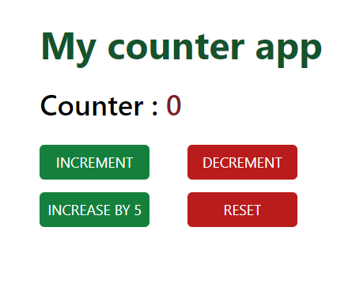

# Simple React Hook Form Page

This project is a single-page application built with TypeScript, React, Tailwind CSS, and React Hook Form. It demonstrates a simple form handling implementation using React Hook Form, showcasing efficient and streamlined form validation and state management.

## Features

- **TypeScript:** Strongly typed codebase for enhanced reliability and maintainability.
- **React:** Component-based architecture for modular and reusable UI components.
- **Tailwind CSS:** Utility-first CSS framework for rapid UI development.
- **React Hook Form:** Simplified form handling and validation with minimal re-renders.

## Live Site

Check out the live version of the project [here](https://simple-counter-app-with-redux-toolkit.vercel.app/).

## Project image

